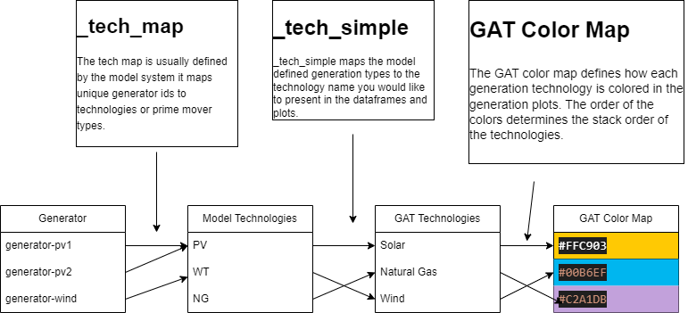

# Grid Analysis Toolkit

The Grid Analysis Toolkit, or GAT, is a python library for providing a simplified and intiuitive interface across multiple Production Cost Modeling and Capacity Expansion Modeling tools related to the Bulk Electrical System.

GAT is primarily built on top of pandas, numpy and matplotlib. GAT also requires h5py and tables to interface with the common Sienna and H5PLEXOS.jl outputs. Objects and functions are designed to return pandas dataframes or matplotlib axes to allow for further customization.

## Installation

GAT can be installed via pip.

`pip install nlr-gat`

(The distribution is named `nlr-gat` because `gat` on PyPI is an
unrelated genomics package; the import package and CLI are still `gat`.)

Or from GitHub, optionally pinning a release:

`pip install git+https://github.com/NatLabRockies/GAT`

`pip install git+https://github.com/NatLabRockies/GAT@v0.1.0`


## Motivation

There are many Simulation tools for modeling the Bulk Electrical System, each of which formats the input configuration, and output simulation files differently. However, each tool is ultimately describing the electrical grid in some way. Each tool simulates, describes or parameterizes some or all of the following, usually in a timeseries format.

* Generation by Generator Type
* Load by electrical buses or area
* Energy Storage Charging and Discharging
* Transmission Flow
* Generator capacities
* Line and Transformer capacities
* Renewable Generation Availability

GAT intends to provide a unified API to all these types of datasets, regardless of the underlying format used by the modeling tool. Furthermore, by providing a unified API, GAT provides additional calculations and datasets not always available in each modeling tool.

* Variable Renewable Energy Curtailment
* Transmission Loading as a percentage of capacity.
* State of Charge
* Native Load, Total Load and Net Load (if one is missing)

The power system modeler and/or analyst often needs to aggregate and simplify data for presentation. GAT provides power system specific plotting functions for the following:

* Annual and Monthly System Dispatch
* Annual Dispatch by Geographic Areas
* Dispatch during Peak And Minimum Demand Time Periods
* Curtailment by Technology
* Transmission Load Duration Curves.

Finally, data analysis and visualization often requires customization to meet project needs. GAT maintains flexiblity by returning pandas dataframes or matplotlib axes that can be further modified to meet the users specific requirements. Each layer of the API is easily accessible if the higher level abstractions fail to meet your needs.

* "The data API is too abstract, I just want to read the raw data" -> Use one of the parser objects.
* "The data API doesn't cover a dataset that I need" -> Use a parser object or the internal scenario parser object.
* "I need plot multiple subplots, some of which aren't covered by gat.quickplots" -> Mix and Match the quickplots and custom plots since quickplots returns matplotlib axes objects.
* "I need to make a plot that uses the same color scheme, but is not covered by quickplots" -> The quickplots core plots provide the core styling for dispatch plot order and color scheme, and can be used for plotting multiple scenarios against each other.


## Configuration

While GAT provides default configurations for Sienna and other NREL tools, it is usually the case that some initial configuration is required to map generation types into something geared towards the audience of the modeler or analyst. Below is a diagram of the mapping flow from model specific generators and types to GAT presentation level types and colors.



For example, in a model you may want to distinguish between 2-hour and 4-hour energy storage types, but would like to combine these into an overall storage type. In GAT, you would do this by mapping both the storage duration types to storage, and then assign a corresponding color in GAT's color map. If you don't want to configure the color map, you can map the generation types to a key in the color map, and use NREL's default color scheme.

More details on configuring GAT can be found [on the Configuring GAT page](api/Configuration/general.md).

```{toctree}
:caption: Configuration
:hidden: true

api/Configuration/general.md
api/Configuration/technology_area.md
api/Configuration/colors.md
api/Configuration/scenario_config.md

```

## Scenario Objects

Scenario Objects are designed to give you a holistic view of Production Cost Model or Capacity Expansion Model simulation. Each Scenario inherits from the BaseScenario by implementing model specific implementations for extracting raw data (e.g. generation or flow) and defining how generators or nodes map to technologies or geographic areas. Once implemented, each model specific object gains access to the base class methods found in BaseScenario. Furthermore, each scenario object implements a set of parsers for gathering model specific raw data, in the case that the bae methods are not sufficient.

```{eval-rst}
.. autosummary::
   :nosignatures:

   ~gat.scenariohandlers.base.BaseScenario
```


```{eval-rst}
.. autosummary::
   :nosignatures:

   ~gat.scenariohandlers.sienna
```

```{eval-rst}
.. autosummary::
   :nosignatures:

   ~gat.scenariohandlers.plexos
```


```{eval-rst}
.. autosummary::
   :nosignatures:

   ~gat.scenariohandlers.reeds
```


```{eval-rst}
.. autosummary::
   :nosignatures:

   ~gat.scenariohandlers.multi
```

```{eval-rst}
.. autosummary::
   :nosignatures:

   ~gat.scenariohandlers.egret
```

```{eval-rst}
.. autosummary::
   :nosignatures:

   ~gat.scenariohandlers.file_scenario
```

```{toctree}
:caption: Scenario Objects
:hidden: true

api/ScenarioObjects/BaseScenario.md
api/ScenarioObjects/SiennaScenario.md
api/ScenarioObjects/Plexos.md
api/ScenarioObjects/ReEDS.md
api/ScenarioObjects/MultiScenario.md
api/ScenarioObjects/EGRET.md


```

# Parsers

Parser Objects provide access to raw simulation and system data in the form of dataframes and simple data structures like dictionaries or lists, with minimal data transformation or manipulation.

It is often the case that Power System simulations are run in parallel across multiple compute nodes, resulting in multiple output files that represent one 8760. Parsers can take a list of h5 files and treat them as one simulation run. When this is the case, the timeseries data are combined by keeping the tail end of the preceding run skipping the head of the following run. This is handled automatically in the Sienna and Plexos parsers.


```{toctree}
:caption: Parser Objects
:hidden: true

api/Parsers/Sienna.md
api/Parsers/Plexos.md
```

```{eval-rst}
.. autosummary::
   :nosignatures:

   ~gat.datahelpers.sienna
```

```{eval-rst}
.. autosummary::
   :nosignatures:

   ~gat.datahelpers.parsers
```


# Plotting

GAT provides capabilities for plotting generation stacks and transmission related plots. These are intended to do most of the heavy lifting in terms of stack order and color schemes, while maintaining the flexibility to adjust, modify and add to the created plots.

```{toctree}
:caption: Core Plotting Functions
:hidden: true

api/Plots/dispatch.md
api/Plots/transmission.md

api/Plots/scenario.md
```


```{toctree}
:maxdepth: 2
:caption: Gallery
:hidden: true

gat_plot_examples/index.rst

```

# Reports (Experimental)

GAT provides command-line reporting framework based on configuration files. You can initialize and run
reporting configurations using commands like `gat init single --help` and `gat run single --help`. Reports are generated using a combination of functions found in the [Scenario Plots]() with output saved to a directory or packaged into a **powerpoint** presentation. Users can override default parameters to tune plots to their needs as well as omit plots.

Users may also extend GAT with custom plots — see [Custom plots and the
reporting framework](extending_plots.md) for the `@plot_function`
decorator, the two-tier plot API, and a worked example.

```{toctree}
:caption: Using the Reporting CLI
:hidden: false

api/cli/commands.md
```

# Project Management CLI (v1.0)

GAT v1.0 introduces a comprehensive project management system for organizing your analysis work. Projects are self-contained directories with YAML configuration files that can be shared across teams using git.

**Key Features:**
- Initialize projects with standard directory structure
- Add scenarios (Sienna, ReEDS, Plexos) via CLI
- Share projects via git repositories
- User-level project references for easy access
- Support for palettes, pipelines, and notebooks

**Quick Start:**
```bash
# Create a new project
gat project init my-analysis --name "My Analysis"

# Add a scenario
gat project add-scenario sienna base_case \
    --system ../data/system.json \
    --simulation ../data/results.h5

# List projects
gat project list
```

```{toctree}
:caption: Project Management (v1.0)
:hidden: false

cli_project_management.md
cli_quick_reference.md
cli_commands.md
migration_v1.md
legacy_handler_deprecation.md
```

# Python API

GAT provides a simple Python API for loading and working with projects, scenarios, and palettes in scripts and notebooks.

**Key Features:**
- Load projects, scenarios, and palettes with smart defaults
- Informative logging to guide usage
- Convenience functions for common workflows
- Handle default resolution automatically

**Quick Start:**
```python
import gat

# Load with defaults
scenario, palette, project = gat.load()

# Load specific resources
scenario, palette, project = gat.load(
    project="my-analysis",
    scenario="base_2035",
    palette="renewable_focus"
)

# Suppress verbose messages
scenario, palette, project = gat.load(verbose=False)
```

```{toctree}
:caption: Python API
:hidden: false

python_api_load.md
sienna_scaling.md
```

# Architecture

GAT v1.0 introduces a duckdb-backed engine (`GATDatabase`) that materializes
power-system data into queryable tables. The architecture pages document the
contract for adding new tools and the migration path from the legacy
pandas-based handlers.

```{toctree}
:caption: Architecture
:hidden: false

architecture/base_system.md
architecture/v1_migration_pattern.md
extending_plots.md
```


